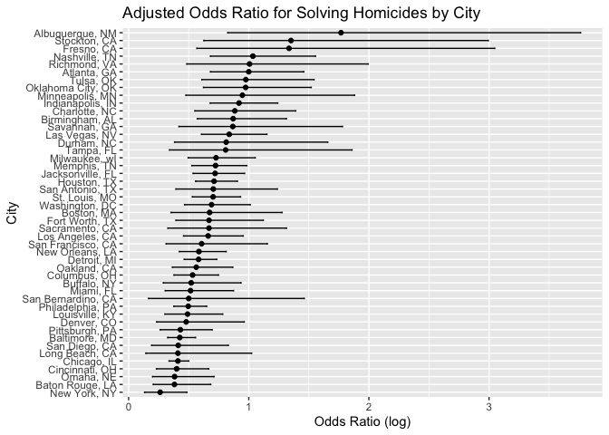
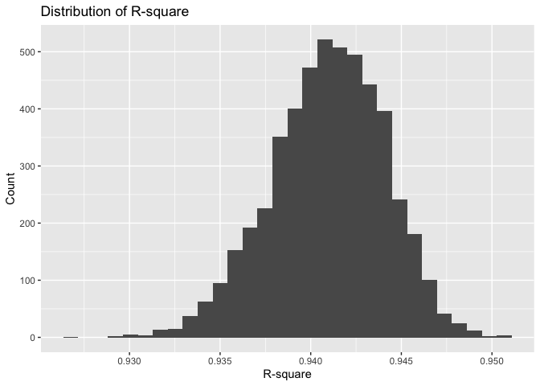
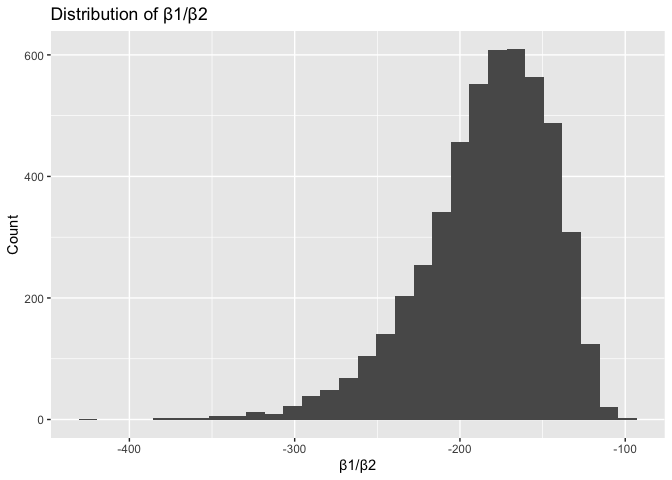
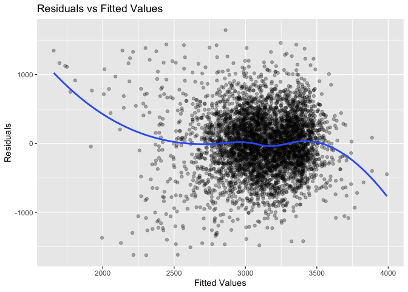
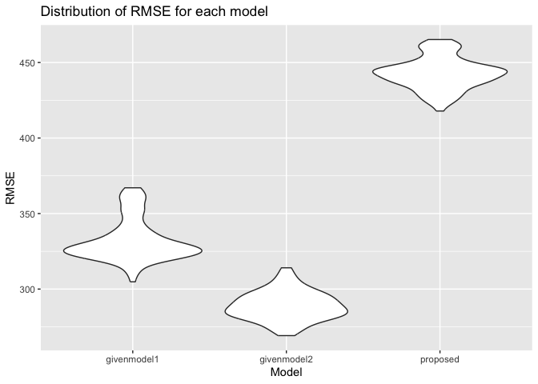

p8105_hw6_nrl2142
================
2025-11-22

# Problem 1

``` r
murder_df = read.csv(file ="homicide-data.csv") |>
  janitor::clean_names()|>
  mutate(
    city_state = str_c(city, state, sep = ", "),
    resolved = as.numeric(disposition == "Closed by arrest"),
    victim_age = as.numeric (victim_age)
  ) |>
  filter(
    !city_state %in% c("Dallas, TX", "Phoenix, AZ", "Kansas City, MO", "Tulsa, AL"),
    victim_race %in% c("White", "Black")) |>
  select(city_state, resolved, victim_age, victim_sex, victim_race)

baltimore_df = murder_df |>
  filter(city_state == "Baltimore, MD")

baltimore_logistic = glm(resolved~victim_age + victim_sex + victim_race, 
                         data = baltimore_df, family=binomial())

baltimore_logistic |>
  broom::tidy(conf.int = TRUE) |>
  filter (term == "victim_sexMale")|>
  mutate(
    odds_ratio = exp(estimate),
    conf_low = exp(conf.low),
    conf_high = exp(conf.high)) |>
  select (odds_ratio, conf_low, conf_high) |>
  knitr::kable(digits =3)
```

| odds_ratio | conf_low | conf_high |
|-----------:|---------:|----------:|
|      0.426 |    0.324 |     0.558 |

``` r
city_glm = function(city_data) {
  model = glm(resolved ~ victim_age + victim_sex + victim_race,
              data = city_data,
              family = binomial())
  model |>
    broom::tidy(conf.int = TRUE) |>
    filter (term == "victim_sexMale")|>
  mutate(
    odds_ratio = exp(estimate),
    conf_low = exp(conf.low),
    conf_high = exp(conf.high)) |>
  select (odds_ratio, conf_low, conf_high)
}

city_data = murder_df |>
  group_by (city_state) |>
  nest() |>
  mutate (model_results = map(data, ~city_glm(.x))) |>
  unnest(model_results)
  
ggplot(city_data, aes(y=reorder(city_state, odds_ratio))) +
  geom_point (aes(x=odds_ratio)) +
  geom_errorbarh(aes(xmin = conf_low, xmax = conf_high), height =0.2) +
  labs(
    title = "Adjusted Odds Ratio for Solving Homicides by City",
    x = "Odds Ratio (log)",
    y = "City"
  )
```

    ## `height` was translated to `width`.

<!-- -->

Among the 50 large cities in the dataset, Albuquerque, NM has the
highest adjusted OR for solving homicides comparing male victims to
female victims while New York, NY has the lowest adjusted OR. This means
that in Albuquerque, male victim cases are more likely to be solved than
female victim cases (adjusted OR \>1) while in New York, female victim
cases are more likely to be solved than male victim cases (adjusted
OR\<1).

# Problem 2

``` r
data("weather_df")

computestats = function(df) {
  fit = lm (tmax ~ tmin+prcp, data = df)
  r_square = glance(fit)$r.squared
  betas = tidy(fit)
  beta_ratio = betas$estimate[betas$term == "tmin"]/betas$estimate[betas$term == "prcp"]
  
  tibble(r_square = r_square, beta_ratio = beta_ratio)
}

n_boot = 5000
boot_results = tibble(boot_id = 1:n_boot) |>
  mutate (
    boot_sample = map(boot_id, ~ sample_n(weather_df, size = nrow(weather_df), replace = TRUE)),
    stats = map(boot_sample, computestats)
  ) |>
  unnest(stats)

plot1 = ggplot(boot_results, aes(x=r_square)) +
  geom_histogram() +
  labs(title = "Distribution of R-square", x = "R-square", y = "Count")

plot2 = ggplot(boot_results, aes(x=beta_ratio)) + geom_histogram() +
  labs(title = "Distribution of β1/β2", x="β1/β2", y ="Count")

plot1
```

    ## `stat_bin()` using `bins = 30`. Pick better value `binwidth`.

<!-- -->

``` r
plot2 
```

    ## `stat_bin()` using `bins = 30`. Pick better value `binwidth`.

<!-- -->

``` r
confidence_r_square = quantile(boot_results$r_square, c(0.025, 0.975))

confidence_beta_ratio = quantile(boot_results$beta_ratio, c(0.025,0.975))

confidence_r_square
```

    ##      2.5%     97.5% 
    ## 0.9343767 0.9466277

``` r
confidence_beta_ratio
```

    ##      2.5%     97.5% 
    ## -279.7489 -125.6859

The range of values of R-square is approximately from 0.930 to 0.950
with a peak at around 0.943. The distribution of R-square appears to be
approximately normally distributed. On the other hand, the range of
values of β1/β2 is approximately from -400 to -100 with a peak at around
-230. The distribution of β1/β2 appears to be left-skewed with a long
tail extending towards the lower values.

The 95% confidence interval for r-square is between 0.934 and 0.947. We
are 95% confidenct that the true r-square value lies within this range.
On the other hand, the 95% confidence interval for β1/β2 is -278.08 and
-125.75. We are 95% confident that the true β1/β2 value lies within this
range.

# Problem 3

According to extant literature, common factors that could affect a
baby’s birth weight are genetic and demographic factors (i.e. infant
sex, race of mother and father), maternal health and lifestyle
(i.e. substance abuse, mother’s age, nutrition which is largely
determined by the socioeconomic status of the family) and, pregnancy and
delivery factors (i.e. gestational age, presence of malformations that
could affect weight). Hence, the proposed model will include the
following variables `babysex`, `fincome`, `frace`, `gaweeks`, `malform`,
`momage`, `mrace` and `smoken` with `bwt` as the outcome variable.

``` r
baby_df = read.csv("birthweight.csv") |>
  janitor::clean_names() |>
  mutate(babysex = factor(babysex, levels = c(1,2), labels = c("Male", "Female")),
         frace = factor (frace, levels =c(1,2,3,4,8,9), labels = c("White", "Black", "Asian", "Puerto Rican", "Other", "Unknown")),
         malform = factor(malform, levels=c(0,1), labels=c("Absent", "Present")),
         mrace = factor(mrace, levels =c(1,2,3,4,8), labels=c("White", "Black", "Asian", "Puerto Rican", "Other"))) |>
  drop_na()

proposed_model = lm(bwt~ babysex + fincome + frace + gaweeks + malform + momage + mrace + smoken, data = baby_df)

baby_df |>
  add_predictions(proposed_model) |>
  add_residuals(proposed_model) |>
  ggplot(aes(x =pred, y = resid)) +
  geom_point(alpha =0.3) +
  geom_smooth(method="loess", se=FALSE) +
  labs(title = "Residuals vs Fitted Values",
       x = "Fitted Values",
       y = "Residuals")
```

    ## `geom_smooth()` using formula = 'y ~ x'

<!-- -->

``` r
givenmodel1 = lm(bwt~blength +gaweeks, data = baby_df)
givenmodel2 = lm(bwt~ bhead*blength*babysex, data = baby_df)

crossvalidate = crossv_mc(baby_df, 100) |>
  mutate(
    train = map(train, as_tibble),
    test = map(test, as_tibble)
  )

crossvalidate_results = 
  crossvalidate |>
  mutate(
    proposed_model= map(train, ~lm(bwt~ babysex + fincome + frace + gaweeks + malform + momage + mrace + smoken, data =.x)),
    givenmodel1 = map(train, ~lm(bwt ~ blength+gaweeks, data =.x)),
    givenmodel2 = map(train, ~lm(bwt~bhead*blength*babysex, data = .x))
  ) |>
  mutate(rmse_proposed = map2_dbl(proposed_model, test, ~rmse(model = .x, data =.y)),
         rmse_givenmodel1 = map2_dbl(givenmodel1, test, ~rmse(model = .x, data = .y)),
         rmse_givenmodel2 = map2_dbl(givenmodel2, test, ~rmse(model =.x, data =.y)))

crossvalidate_results |>
  select(starts_with("rmse")) |>
  pivot_longer(
    everything(),
    names_to = "model",
    values_to = "rmse",
    names_prefix = "rmse_"
  ) |>
  ggplot(aes(x=model, y=rmse)) +
  geom_violin() +
  labs(
    title = "Distribution of RMSE for each model",
    x = "Model",
    y = "RMSE"
  )
```

<!-- -->

From the plot, my proposed model appears to perform worse compared to
the given models as it has the highest RMSE values on the y-axis,
indicating lower accuracy in predictions.
